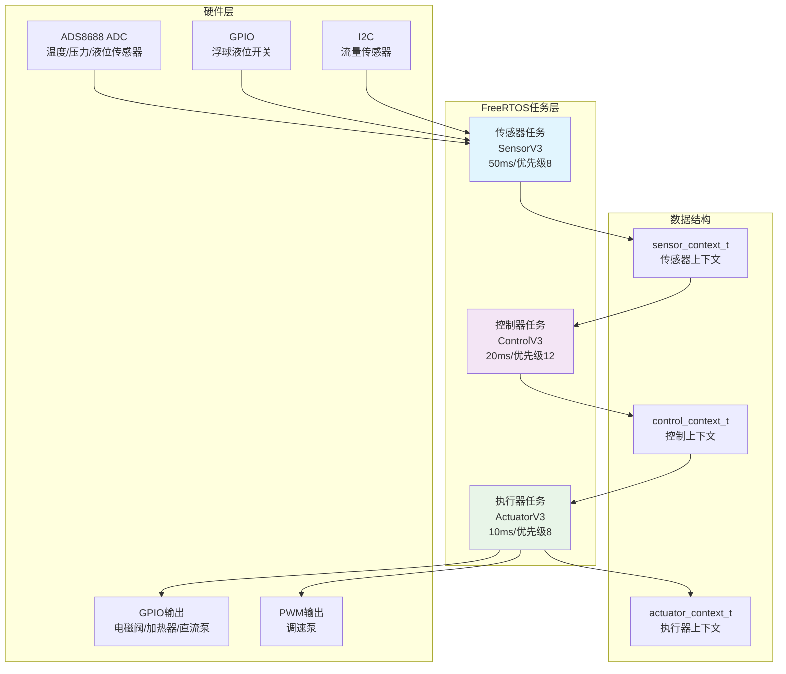
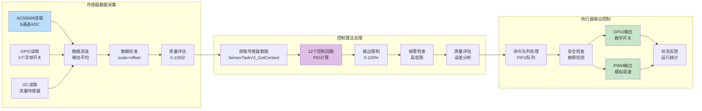
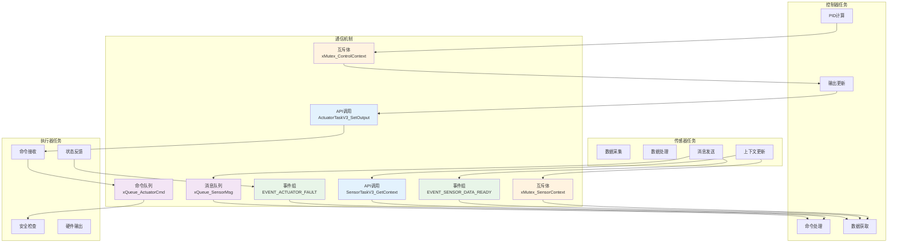
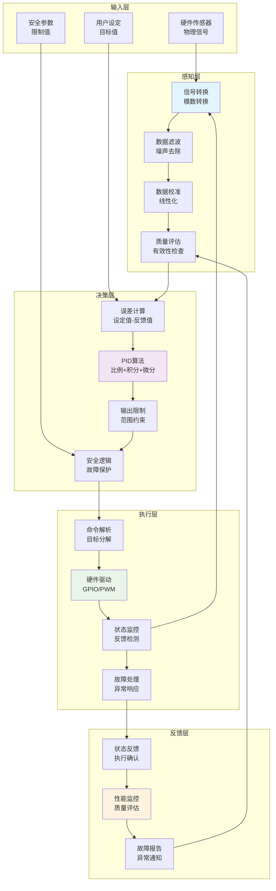
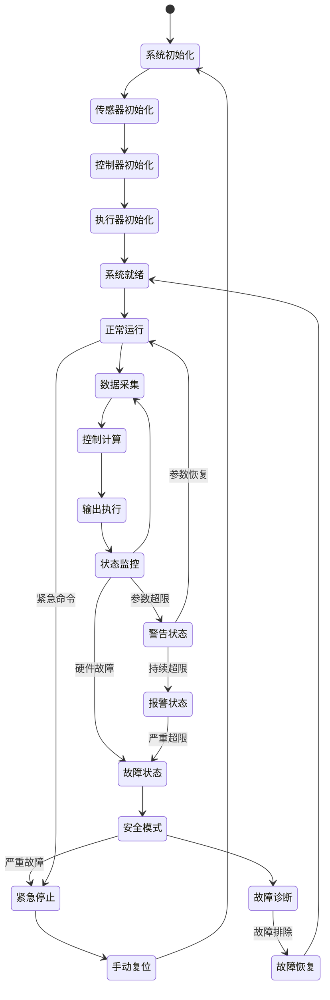

# 墨路控制系统数据流程思维导图

本文档包含多个思维导图，从不同角度展示墨路控制系统的数据处理流程和任务配合机制。

## 1. 系统整体架构图

## 2. 数据流向详细图

## 3. 控制回路映射关系图

```mermaid
graph TD
    subgraph "传感器"
        ST1[SENSOR_TEMP_1<br/>温度1]
        ST2[SENSOR_TEMP_2<br/>温度2]
        ST3[SENSOR_TEMP_3<br/>温度3]
        SP1[SENSOR_PRESSURE_1<br/>压力1]
        SP2[SENSOR_PRESSURE_2<br/>压力2]
        SP3[SENSOR_PRESSURE_3<br/>压力3]
        SP4[SENSOR_PRESSURE_4<br/>压力4]
        SL1[SENSOR_LEVEL_FLOAT_1<br/>浮球1]
        SL2[SENSOR_LEVEL_FLOAT_2<br/>浮球2]
        SL3[SENSOR_LEVEL_FLOAT_3<br/>浮球3]
        SLA[SENSOR_LEVEL_ANALOG<br/>模拟液位]
        SF[SENSOR_FLOW<br/>流量]
    end

    subgraph "控制回路"
        CT1[CONTROL_LOOP_TEMP_1<br/>温度控制1]
        CT2[CONTROL_LOOP_TEMP_2<br/>温度控制2]
        CT3[CONTROL_LOOP_TEMP_3<br/>温度控制3]
        CP1[CONTROL_LOOP_PRESSURE_1<br/>压力控制1]
        CP2[CONTROL_LOOP_PRESSURE_2<br/>压力控制2]
        CP3[CONTROL_LOOP_PRESSURE_3<br/>压力控制3]
        CP4[CONTROL_LOOP_PRESSURE_4<br/>压力控制4]
        CL1[CONTROL_LOOP_LEVEL_1<br/>液位控制1]
        CL2[CONTROL_LOOP_LEVEL_2<br/>液位控制2]
        CL3[CONTROL_LOOP_LEVEL_3<br/>液位控制3]
        CL4[CONTROL_LOOP_LEVEL_4<br/>液位控制4]
        CF[CONTROL_LOOP_FLOW<br/>流量控制]
    end

    subgraph "执行器"
        AH1[ACTUATOR_HEATER_1<br/>加热器1]
        AH2[ACTUATOR_HEATER_2<br/>加热器2]
        AH3[ACTUATOR_HEATER_3<br/>加热器3]
        APS1[ACTUATOR_PUMP_SPEED_1<br/>调速泵1]
        APS2[ACTUATOR_PUMP_SPEED_2<br/>调速泵2]
        AV1[ACTUATOR_VALVE_1<br/>电磁阀1]
        AV2[ACTUATOR_VALVE_2<br/>电磁阀2]
    end

    ST1 --> CT1 --> AH1
    ST2 --> CT2 --> AH2
    ST3 --> CT3 --> AH3
    SP1 --> CP1 --> APS1
    SP2 --> CP2 --> APS2
    SP3 --> CP3 --> APS1
    SP4 --> CP4 --> APS2
    SL1 --> CL1 --> AV1
    SL2 --> CL2 --> AV2
    SL3 --> CL3 --> AV1
    SLA --> CL4 --> AV2
    SF --> CF --> APS1

    style CT1 fill:#ffcdd2
    style CT2 fill:#ffcdd2
    style CT3 fill:#ffcdd2
    style CP1 fill:#c8e6c9
    style CP2 fill:#c8e6c9
    style CP3 fill:#c8e6c9
    style CP4 fill:#c8e6c9
    style CL1 fill:#bbdefb
    style CL2 fill:#bbdefb
    style CL3 fill:#bbdefb
    style CL4 fill:#bbdefb
    style CF fill:#fff9c4
```

## 4. 任务时序关系图

```mermaid
gantt
    title 墨路控制系统任务时序图
    dateFormat X
    axisFormat %L ms

    section 执行器任务
    EXEC1    :0, 10
    EXEC2    :10, 20
    EXEC3    :20, 30
    EXEC4    :30, 40
    EXEC5    :40, 50
    EXEC6    :50, 60
    EXEC7    :60, 70
    EXEC8    :70, 80

    section 控制器任务
    CTRL1    :0, 20
    CTRL2    :20, 40
    CTRL3    :40, 60
    CTRL4    :60, 80

    section 传感器任务
    SENS1    :0, 50
    SENS2    :50, 100
```

## 5. 通信机制图

## 6. 数据处理流水线图

## 7. 系统状态机图

## 总结

这些思维导图从不同维度展示了墨路控制系统的运作机制：

1. **架构图**: 展示硬件、任务和数据结构的层次关系
2. **数据流图**: 详细描述数据在系统中的流转过程
3. **映射关系图**: 清晰展示传感器-控制回路-执行器的对应关系
4. **时序图**: 显示三个任务的时间关系和并发执行
5. **通信机制图**: 描述任务间的通信方式和同步机制
6. **流水线图**: 展示从输入到输出的完整数据处理流程
7. **状态机图**: 描述系统的各种运行状态和状态转换

通过这些可视化图表，可以清楚地理解墨路控制系统的工作原理和各组件之间的协调配合机制。